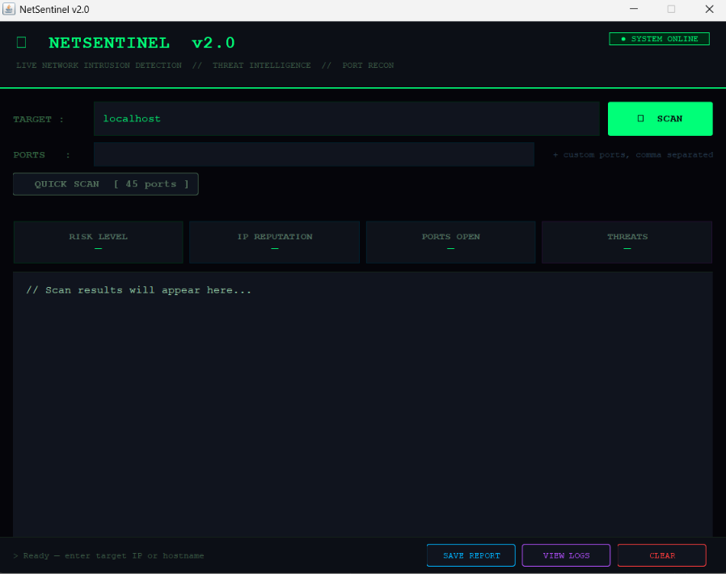
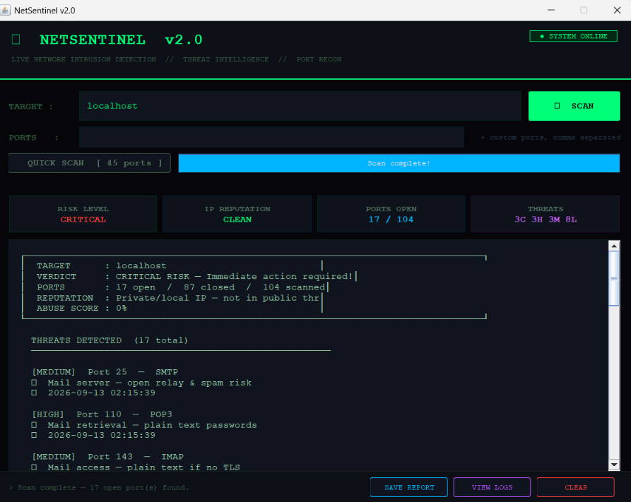

# NetSentinel

NetSentinel is a Java-based network security application that scans a target IP address or hostname for open ports, analyzes potential security risks, and displays the results through a desktop graphical interface.

The project was developed to apply Java, Object-Oriented Programming, socket programming, multithreading, and computer networking concepts in a practical cybersecurity application.

## Features

- Scan an IP address or hostname for open ports
- Quick scan of commonly used and security-sensitive ports
- Full port scanning
- Custom port scanning
- Service identification for known ports
- Threat classification into LOW, MEDIUM, HIGH, and CRITICAL levels
- Overall risk assessment based on detected services
- IP reputation checking
- Multithreaded port scanning using Java ExecutorService
- Scan progress tracking
- Save scan results to log files
- View previous scan logs
- Desktop graphical interface built using Java Swing

## Screenshots

### Main Interface



### Network Scan Results



> The scan shown above was performed on `localhost` for demonstration purposes. Risk levels are generated based on detected open ports and associated services.

## Technologies Used

- Java
- Java Swing
- Socket Programming
- Object-Oriented Programming (OOP)
- Multithreading
- Java Collections
- File Handling
- HTTP API Integration
- Computer Networks

## How It Works

NetSentinel accepts an IP address or hostname as a target and attempts socket connections to identify open ports.

Detected ports are analyzed based on their associated services and predefined security risk levels. The application then generates an overall risk assessment based on the scan results.

For larger scans, NetSentinel uses Java `ExecutorService` to scan multiple ports concurrently instead of checking ports sequentially.

Results are displayed through a Java Swing interface and can also be stored in log files for later review.

## Project Structure

```text
src/
├── engine/
│   ├── Scanner.java
│   ├── PortScanner.java
│   ├── ThreatAnalyzer.java
│   ├── ReputationChecker.java
│   └── IANAPortLoader.java
├── model/
│   ├── Threat.java
│   ├── ThreatLevel.java
│   └── ScanResult.java
├── thread/
│   └── ScanWorker.java
├── log/
│   ├── AlertLogger.java
│   └── LogManager.java
└── ui/
    ├── MainWindow.java
    └── ResultPanel.java
```

## Concepts Applied

- Object-Oriented Programming (OOP)
- Java socket programming
- TCP/IP ports and network services
- Multithreading and concurrent execution
- Java Collections
- File handling and logging
- GUI development with Java Swing
- Basic API integration

## Running the Project

### Requirements

- Java Development Kit (JDK)
- Windows, Linux, or macOS
- Internet connection for online IP reputation checks

### Clone the Repository

```bash
git clone https://github.com/megha653/NetSentinel.git
```

Open the project in an IDE such as IntelliJ IDEA, Eclipse, or VS Code.

On Windows, the included batch file can be used to run the application:

```bash
run.bat
```

## What I Learned

Through NetSentinel, I gained practical experience with:

- Java socket programming
- IP addresses, ports, and network services
- Object-Oriented Programming
- Multithreaded programming
- Concurrent task execution
- Java Swing GUI development
- File handling and logging
- Organizing a Java application into separate packages and components
- Basic networking and security concepts

## Future Improvements

- More detailed service detection
- Improved IP reputation analysis
- Configurable scanning profiles
- Exportable scan reports
- Improved error handling and input validation
- Additional network security checks

## Disclaimer

NetSentinel is an educational project intended for learning networking and cybersecurity concepts. Only scan systems and networks that you own or have explicit permission to test.

## Author

**Megha Banerjee**

GitHub: [megha653](https://github.com/megha653)
